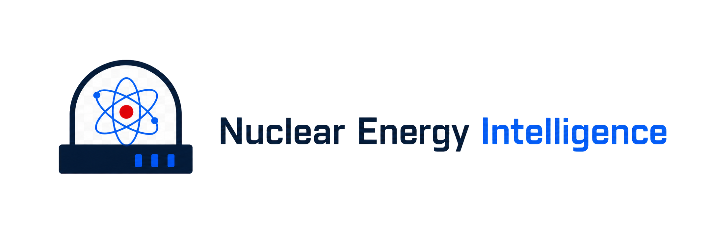
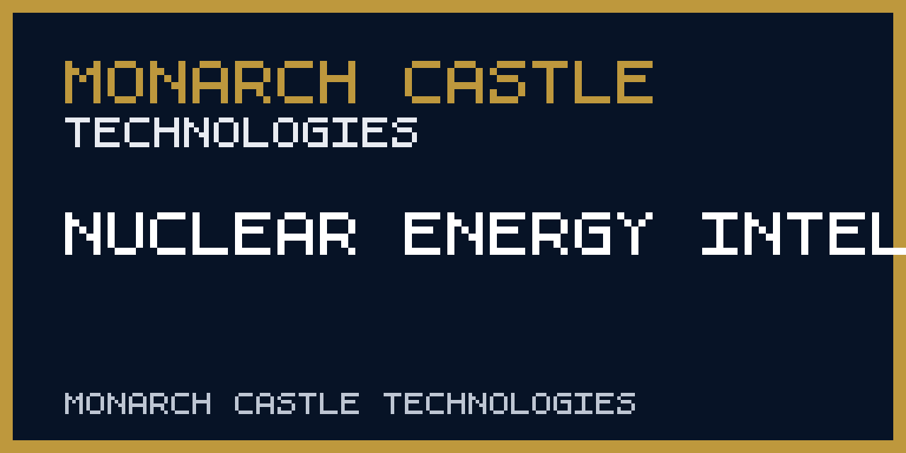

<div align="center">
  <picture><source media="(prefers-color-scheme: dark)" srcset="https://raw.githubusercontent.com/monarchcastletech/NuclearEnergyIntelligence/main/docs/logo-dark.png"></picture>
  <!-- CODEX: generate a clean product logo — a stylized reactor containment dome / atomic core rendered as a minimalist crest in deep navy (#0b1f3a) and a single warning-red accent, matching the Monarch Castle dark, monospace intelligence aesthetic. Transparent background, square. -->

  # Nuclear Energy Intelligence
  ### Source-traced nuclear electricity shares across 23 selected countries

  
  
  
  

  
  
  
  
</div>

> **Current public release** — The portal displays the latest available annual nuclear-electricity share for 23 selected countries from Our World in Data, with each observation year and the refresh method. Earlier facility, project, cost, retirement, and fuel-cycle modules are withheld pending dated primary-source evidence for each displayed record. This release is an observed-data comparison, not a forecast or complete reactor inventory.

## Current method

The scheduled refresh reads the [Our World in Data nuclear-electricity CSV](https://ourworldindata.org/grapher/share-electricity-nuclear.csv), selects each country's latest annual observation, rounds the share to one decimal, and records that country's observation year. Publication requires at least 20 matched countries and a latest available year of 2023 or newer. A failed source check retains the last good snapshot and marks the check as retained. The public interface displays only these source-traced shares.

The previous `src/data/exposure.json`, `reactors.json`, `chokepoints.json`, and `uranium_cycle.json` remain in Git history and the repository as **unverified research reference material**. Their manually entered counts, capacities, costs, delays, capacity-factor sequences, and market shares lack record-level primary-source citations and are excluded from the public bundle. Do not use them as current measurements.

## 🖼️ Preview
<!-- CODEX: capture real screenshots of the running portal (npm run dev) and drop them into docs/ -->
<!--  (screenshot pending) -->
<!-- CODEX: dark-theme Leaflet world map showing reactor markers and the supply-chain chokepoint toggle active -->

<!--  (screenshot pending) -->
<!-- CODEX: the Exposure Ranking Array table, France at top, showing nuclear share %, reactor count, net capacity -->

<!--  (screenshot pending) -->
<!-- CODEX: side-by-side of the Capital Scatterplot (delay vs cost) and the Retirement Cliff bar chart -->

## 🧭 What it does
The portal is a source-traced nuclear electricity-share table. Search and percentage bars are presentation only; they do not create a new risk score. The earlier modules listed below are withheld until their individual records are sourced.

- **Public table** — country-level nuclear share and observation year for 23 selected countries.
- **Interactive Map** — a label-stripped dark Leaflet map plotting reactor sites and, on toggle, the ultra-heavy forging and fuel-cycle chokepoints that constrain new build.
- **Capital Scatterplot** — plots project cost against schedule delay to make Western greenfield cost-overrun patterns legible at a glance.
- **Fuel Cycle Matrix** — decomposes the front end of the fuel cycle (mining → conversion → enrichment) into per-stage market leadership.
- **Retirement Cliff Chart** — age-profiles the operating fleet to expose the coming wave of terminal-limit retirements.
- **Türkiye Dossier** — a regional strategic deep dive on the Akkuyu VVER program.
- **Featured Reports & Policy Memo** — short narrative briefs and a methodology modal explaining the assessment framework.

## 🗂️ Data & provenance
The current public dataset is `src/data/verified-shares.json`, derived from the OWID CSV by `scripts/refresh-data.mjs`. A row's source and observation year are available in the interface. The older files below are not public evidence: being committed to source control does not independently verify their contents.

| Dataset | Records | Key fields |
|---|---|---|
| `exposure.json` | National nuclear dependence | `countryName`, `nuclearSharePct`, `activeReactorCount`, `activeNetCapacityMw` |
| `reactors.json` | Reactor sites & units | `location`, `lat/lng`, `capacityMw`, `gridShare`, `buildYear`, `capitalCostBillion`, `delayYears`, `supplyChainRisk`, `capacityHistory` |
| `chokepoints.json` | Heavy-forging / fuel-cycle nodes | `name`, `country`, `lat/lng`, `status`, `type`, `description` |
| `uranium_cycle.json` | Fuel-cycle stages | `process`, `unit`, per-stage `leaders[]` with `sharePct` |

**Assessment methodology.** Industrial processes are scored against a three-level constraint scale — `SEVERE CONSTRAINT` / `HIGH CONSTRAINT` / `SITE-DEPENDENT` — informed by permitting, financing and delivery evidence. These are comparative assessments, not deterministic outcomes. The framework is documented in the in-app *Intelligence Methodology* memo.

> **Provenance.** Nuclear generation shares refresh weekly from the keyless Our World in Data series. Detailed reactor, capacity, project and chokepoint records are withheld from the public release pending record-level source verification.

## 🛠️ Tech stack
- **UI:** React 19 + TypeScript 5.9 (strict)
- **Build / dev server:** Vite 7 (fast HMR, optimized production bundling)
- **Geospatial:** Leaflet + react-leaflet (dark, label-stripped interactive map)
- **Charts:** Recharts (scatter plots, demographic bar charts)
- **Quality:** ESLint 9 + typescript-eslint
- **Deploy:** `gh-pages` → **GitHub Pages** (static hosting)

## 🚀 Getting started
**Live brief:** https://monarchcastletech.github.io/NuclearEnergyIntelligence/

Requires Node.js 18+ and npm.

```bash
# 1. Install dependencies
npm install

# 2. Run the dev server (http://localhost:5173)
npm run dev

# 3. Type-check + build a production bundle into /dist
npm run build

# 4. Preview the production build locally
npm run preview

# 5. Deploy the /dist bundle to GitHub Pages
npm run deploy
```

The compiled `/dist` folder is fully static and can be hosted on any CDN or object store to specification.

## 🧱 Part of Monarch Castle
> A product of **Energy Intelligence** · **Monarch Castle Technologies** — an operating company of **[Monarch Castle Holdings](https://github.com/MonarchCastleHoldings)**.
> Sister companies: [Monarch Castle Technologies](https://github.com/monarchcastletech) · [Strategic Data Company of Ankara](https://github.com/SDCofA)

## 📜 License
See `LICENSE`. © 2026 Monarch Castle Holdings · Ankara, Türkiye.

<div align="center"><sub>🏰 Monarch Castle Holdings — turning open-source noise into lawful, verified, decision-grade intelligence.</sub></div>

---

<!-- repository-hygiene:start -->


Source-traced annual nuclear-electricity shares for selected countries; facility and supply-chain analysis is withheld pending record-level verification.


## Repository status

Lifecycle: **Active**. The badge and this statement describe maintenance status, not service availability.

## Public access

[Open the published project](https://monarchcastletech.github.io/NuclearEnergyIntelligence/)

## Screenshots



The preview is maintained as a repository asset; the live interface or generated output remains authoritative.

## Data and methodology

- [README.md](README.md)
- [src/](src/)

These repository-specific sources define the methodology or provenance boundary. Source dates, transformation steps, and known gaps must travel with analytical outputs.

## Update frequency

Weekly automated source check and GitHub Pages deployment. If the public source is unavailable or invalid, the workflow retains the last known good dataset and records the failed check.

## Quick start

```shell
npm ci
```

```shell
npm run dev
```

Run only in a trusted development environment and review repository-specific prerequisites before using networked or hardware features.

## Architecture

- `src/` — repository-specific implementation, data, or configuration boundary.
- `public/` — repository-specific implementation, data, or configuration boundary.

## Tests

```shell
npm test
```

```shell
npm run lint
```

```shell
npm run build
```

## Provenance

Original software history is maintained in Git. External datasets, reports, trademarks, screenshots, and assets are not relicensed by this repository; see [THIRD_PARTY_NOTICES.md](THIRD_PARTY_NOTICES.md) before reuse.

## Forecast limitations

Scenarios and scores are comparative analytical aids. Review their source dates, assumptions and methodology before use.

## Security

Do not publish vulnerabilities in an issue. Use GitHub's private vulnerability-reporting flow when available, or follow the [organization security policy](https://github.com/MonarchCastleTech/.github/security/policy).

## License

Original repository code and documentation are available under **MIT**; see [LICENSE](LICENSE). That license does not override third-party terms documented in [THIRD_PARTY_NOTICES.md](THIRD_PARTY_NOTICES.md).

## Citation

Use the machine-readable [CITATION.cff](CITATION.cff). Cite the specific commit and, for analytical use, record the data or model snapshot date.

## Masterbrand endorsement

Nuclear Energy Intelligence is a Monarch Castle Technologies project. **Part of Monarch Castle Technologies.**

<!-- repository-hygiene:end -->
